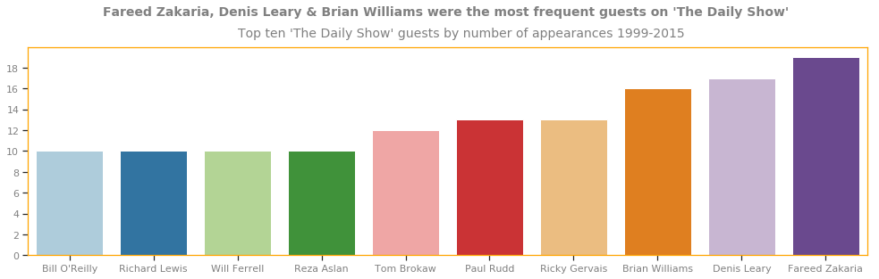

<html>
<head>
<meta name="viewport" content="width=device-width, initial-scale=1">

</head>
<body>

  
1 / 3

  
  

   
From 

  
2 / 3

  
  

  
 From 

  
3 / 3

  
  

  
Portrait of the Artist as a Young Data Scienttist

<a class="prev" onclick="plusSlides(-1)">&#10094;</a>
<a class="next" onclick="plusSlides(1)">&#10095;</a>

 

   
   
   

   
   
   

I'm a junior data scientist located in SF, working on certification with Lambda school. I specialize in analysis, visualization and breaking down the world of data to the corporate audience. You can follow
updates to this portfolio on my Twitter and Github. 
 

Gmail: <a href= "mailto:tristap98@gmail.com">Tristap98</a> 
Github.io: <a href = "https://github.com/trista-paul">trista-paul</a> 
Medium: <a href="https://medium.com/@tristap98">Trista P</a> 
Twitter: in progress 
Linkedin: in progress 
