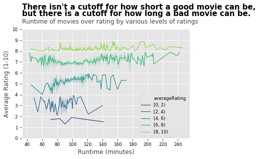

<html>
<head>
<meta name="viewport" content="width=device-width, initial-scale=1">

</head>
<body>

<h2>Projects</h2>
<a href= "https://trista-paul.github.io/">Home</a> | <a href= "https://trista-paul.github.io/projects">Projects</a> 

  

  	
  

  

    <h2><a href = "https://medium.com/@tristap98/movie-night-coming-up-an-analysis-of-what-goes-into-bad-imdb-ratings-7f290cac2e7f"> Movie Night Coming Up? An Analysis of Bad IMDb Ratings</a> </h2>
    
Ever wonder who the worst director by average rating of all their movies is? In my first data science project I dive into IMDb's datasets and rank directors and genres, graph how runtime effects ratings and analyze movie ratings over the decades.

  

</body>
</html>
